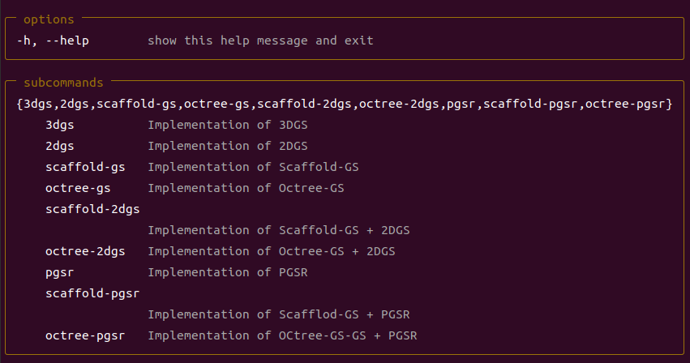
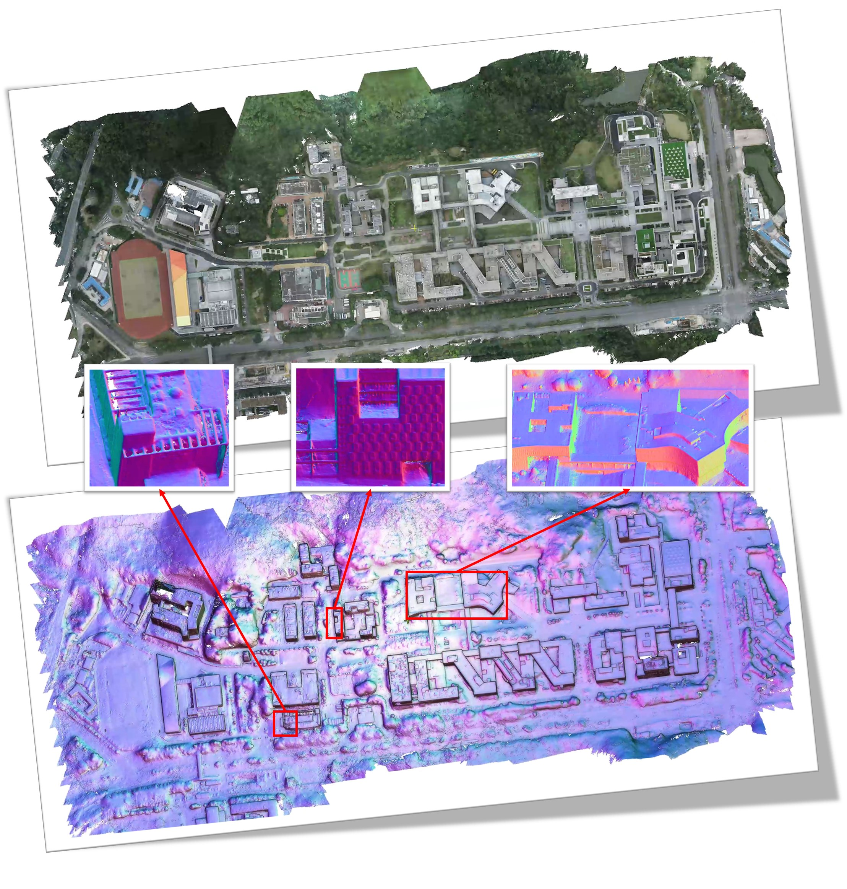
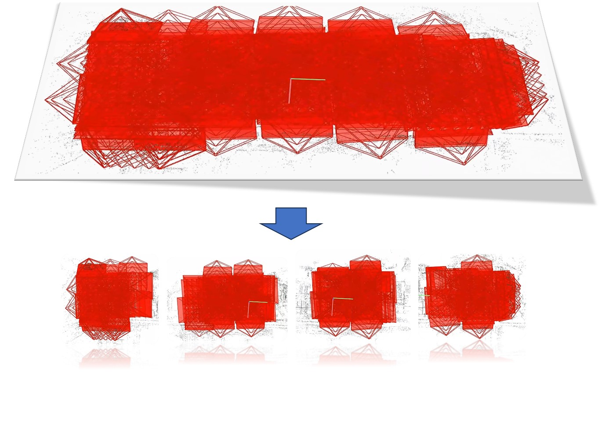

# GS-SR: Gaussian Splatting for Surface Reconstruction
This project was used to solve the task of surface reconstruction of a large scene. 

😭The project was not innovative. 

😮It was a purely combinatorial work. 

😜Just for fun!!!

We have reorganised the 3dgs pipeline according to [sdfstudio](https://github.com/autonomousvision/sdfstudio) to facilitate the introduction of several different surface reconstruction methods. Please use the following command to see the currently supported methods.
```bash
python train.py -h
```
<p align="center">

</p>

## Test Result
<p align="center">

</p>

 The test results are shown above. We use Lower-Campus(See [GauU-Scene](https://arxiv.org/abs/2401.14032) for detailed information) UAV data. The results of the above figure were obtained by "VastGaussian + Octree-GS + 2DGS". Compared to other methods, the method in this project is very robust and is also able to obtain more accurate results in the marginal areas of the scene and in texture-less areas. 
 
 The main components of this project are as follows:

- This project uses the idea of [VastGaussian](https://arxiv.org/abs/2402.17427) to partition the scene, with slightly different implementation details. Input a colmap-sfm-output, and after partitioning, each tile remains in colmap-sfm format. This allows partitioning to be completely independent of subsequent algorithms.

- [Scaffold-GS](https://arxiv.org/abs/2312.00109) was chosen as the scene representation for this project because Scaffold-GS is more robust to view-dependent effects (e.g. reflection, shadowing); and alleviates the artifacts (e.g. floaters, structure error caused by redundant 3D Gaussians; and has more accurate surface artefacts. shadowing); and alleviates the artifacts (e.g. floaters, structure error) caused by redundant 3D Gaussians; and have more accurate surface reoncstruction in texture-less area. [Octree-GS](https://arxiv.org/abs/2403.17898) supports level of details (LOD), very friendly for large scene reconstruction.

- Two surface reconstruction methods [2DGS](https://arxiv.org/abs/2403.17888) and [PGSR](https://arxiv.org/abs/2406.06521) are selected for this project. Among them, 2DGS is one of the fastest surface reconstruction methods, and PGSR is the method with the best reconstruction quality.

## Installation

We tested on a server configured with Ubuntu 22.04, cuda 12.3 and gcc 11.4.0. Other similar configurations should also work, but we have not verified each one individually.

1. Clone this repo:

```bash

git clone https://github.com/yanxian-ll/GS-SR
cd GS-SR
```

2. Install dependencies

```bash

conda env create --file environment.yml
conda activate gssr
```

## Preprocess Data

1. First, create a  ```test/``` folder inside the project path by 

```bash

mkdir test
```

The input data stucture will be organised as follows:

```
test/
├── scene1/
│   ├── input
│   │   ├── IMG_0.jpg
│   │   ├── IMG_1.jpg
│   │   ├── ...
...
```

2. Then, run colmap sfm by 

```bash

python convert.py -s ./test/scene1 --use_aligner
```

The output structure will be organised as follows:

```
test/
├── scene1/
│   ├── images
│   │   ├── IMG_0.jpg
│   │   ├── IMG_1.jpg
│   │   ├── ...
│   ├── sparse/
│       └──0/
...
```

3. If you need partition the scene:

```bash

python split_scene.py -s ./test/scene1 -o ./test/scene1 -m 4 -n 1
```

Where, '-m' and '-n' denote the columns and rows of the splitted scene, respectively. Currently, we have to manually determine m and n based on the scene scope and coordinate system orientation. For Lower-campus dataset, m and n are taken as 4 and 1 respectively.

<p align="center">

</p>

The output structure will be organised as follows:

```
test/
├── scene1/
│   ├── sparse/
│   │   ├──0/
│   │   └──aligned/
│   ├── tile_0000
│   │   ├── sparse
│   │   ├── images
│   │   └── box.txt
│   ├── tile_0001
│   │   ├── sparse
│   │   ├── images
│   │   └── box.txt
│   ├── ...
...
```

## Provided Data

### Public Data:

- The MipNeRF360 scenes are provided by the paper author [here](https://jonbarron.info/mipnerf360/). 

- The SfM data sets for Tanks&Temples and Deep Blending are hosted by 3D-Gaussian-Splatting [here](https://repo-sam.inria.fr/fungraph/3d-gaussian-splatting/datasets/input/tandt_db.zip).

- The BungeeNeRF dataset is available in [Google Drive](https://drive.google.com/file/d/1nBLcf9Jrr6sdxKa1Hbd47IArQQ_X8lww/view?usp=sharing)/[百度网盘[提取码:4whv]](https://pan.baidu.com/s/1AUYUJojhhICSKO2JrmOnCA). 

- The MatrixCity dataset can be downloaded from [Hugging Face](https://huggingface.co/datasets/BoDai/MatrixCity/tree/main)/[Openxlab](https://openxlab.org.cn/datasets/bdaibdai/MatrixCity)/[百度网盘[提取码:hqnn]](https://pan.baidu.com/share/init?surl=87P0e5p1hz9t5mgdJXjL1g). [Point clouds](https://drive.google.com/file/d/1J5sGnKhtOdXpGY0SVt-2D_VmL5qdrIc5/view?usp=sharing) used for training.

### Our Test Data:

- The Lower-Campus dataset can be downloaded from [百度网盘](https://pan.baidu.com/s/1SwkUAs2HIeTMDX1hzqdPmg?pwd=gssr). We provide raw images, GT point-clouds and SFM processed data.

- The CSU-Library dataset can be download from [百度网盘](https://pan.baidu.com/s/1XeWPyw9v_0d9vJEzv97cJQ?pwd=gssr). This is a building-level dataset with almost 300+ images. This dataset contains a large number of repeated textures and texture-less areas, making it a very difficult dataset to work with.

### Custom Data:

For custom data, you should process the image sequences with [Colmap](https://colmap.github.io/) to obtain the SfM points and camera poses.

If partitioning is required, we recommend using ```colmap model_orientation_aligner``` aligning the coordinate axis of a model.

## How to Use

### Training

```bash

python train_split.py -s ./test/scene1 -m ./output
```

### Extract Mesh

```bash

python extract_mesh_split.py ./test/scene1 -m ./output
```

## Acknowledgements
The project builds on the following works:
- https://github.com/kangpeilun/VastGaussian
- https://github.com/graphdeco-inria/gaussian-splatting
- https://github.com/city-super/Scaffold-GS
- https://github.com/city-super/Octree-GS
- https://github.com/hbb1/2d-gaussian-splatting
- https://github.com/zju3dv/PGSR
