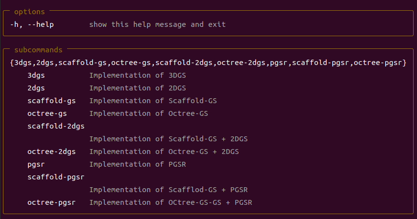
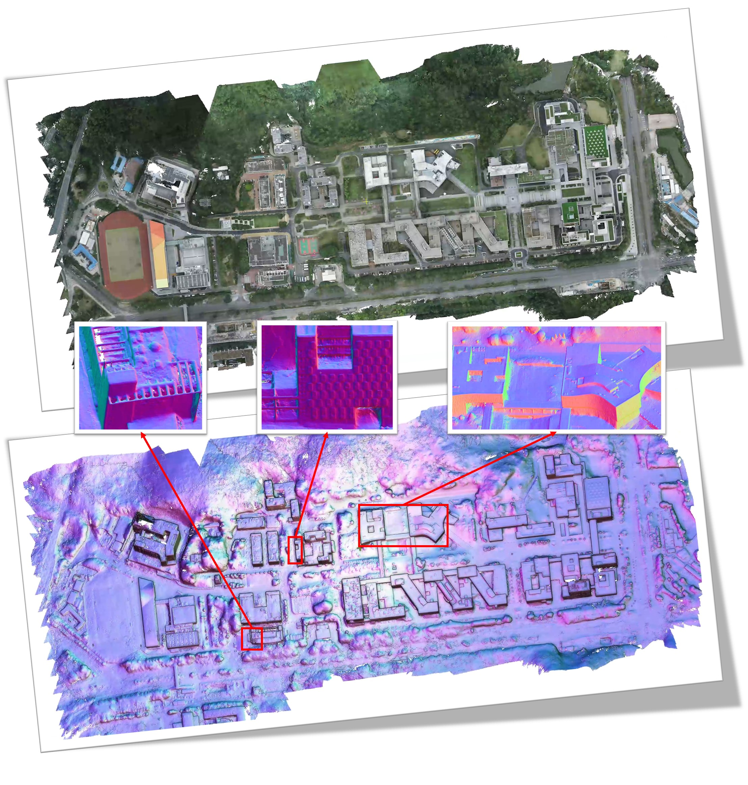
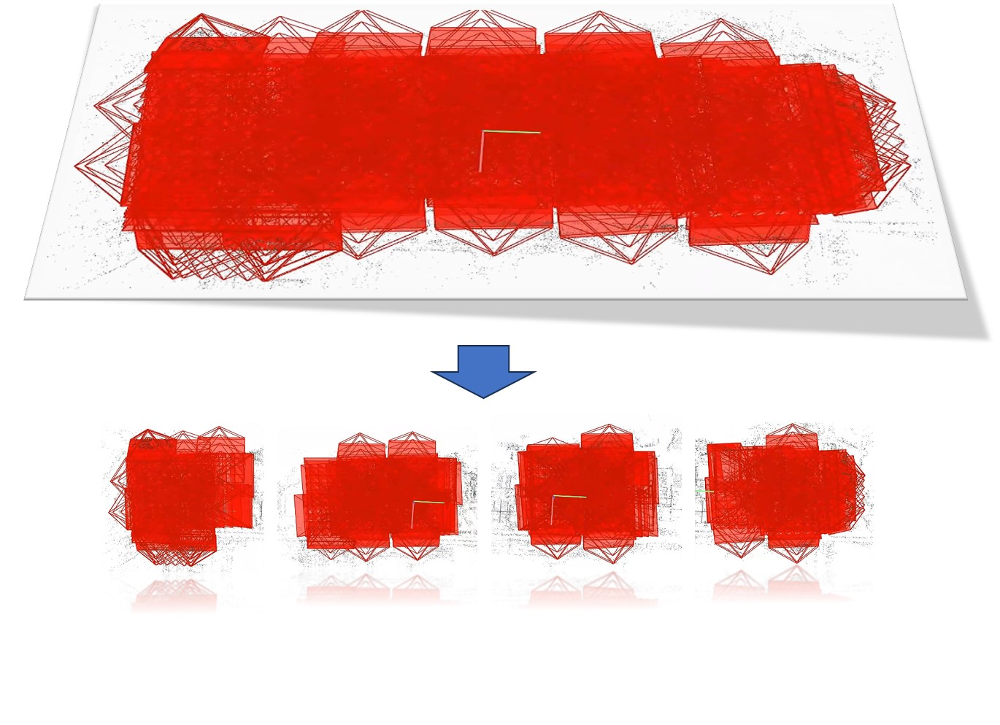

# GS-SR: Gaussian Splatting for Surface Reconstruction

This project aims to solve the task of surface reconstruction for large scenes.

😜 Just for fun!!!

We have reorganized the 3DGS pipeline according to [sdfstudio](https://github.com/autonomousvision/sdfstudio) to facilitate the introduction of various surface reconstruction methods. Please use the following command to see the currently supported methods.

```bash
python train.py -h
```

<p align="center">

</p>

## Main Components

- **Partition**: This project follows the idea of [VastGaussian](https://arxiv.org/abs/2402.17427) to partition the scene. By inputting a COLMAP-SfM output, each tile remains in COLMAP-SfM format after partitioning. This ensures that partitioning is completely independent of subsequent algorithms.

- **Representation**: [Scaffold-GS](https://arxiv.org/abs/2312.00109) was chosen as the scene representation for this project due to its robustness against view-dependent effects (e.g., reflection, shadowing). It also alleviates artifacts such as floaters and structural errors caused by redundant 3D Gaussians, providing more accurate surface reconstruction in texture-less areas. Additionally, [Octree-GS](https://arxiv.org/abs/2403.17898) supports levels of detail (LOD), making it very suitable for large scene reconstruction.

- **Surface Reconstruction**: Two surface reconstruction methods, [2DGS](https://arxiv.org/abs/2403.17888) and [PGSR](https://arxiv.org/abs/2406.06521), were selected for this project. 2DGS is one of the fastest surface reconstruction methods, while PGSR offers the best reconstruction quality.

- **Orthographic Rendering**: The project supports orthographic image rendering for all methods, enabling the generation of high-quality orthophotos and digital surface models (DSM) from trained Gaussian splatting models. This capability is essential for photogrammetric applications and large-scale mapping.

- **Satellite Image Rendering and DSM Extraction**: The project supports rendering satellite images and extracting digital surface models (DSM) from trained Gaussian splatting models, enabling large-scale geospatial applications.

<p align="center">

</p>

We used UAV data from the Lower-Campus (see [GauU-Scene](https://arxiv.org/abs/2401.14032) for detailed information). The results in the figure were obtained using the "VastGaussian + Octree-2DGS" method. Compared to other methods, the approach used in this project is very robust and achieves more accurate results in the marginal areas of the scene and in texture-less areas. Notably, we did not apply any special processing to the marginal areas of the scene.

## Installation

We conducted our tests on a server configured with Ubuntu 22.04, CUDA 12.3, and GCC 11.4.0. While other similar configurations should also work, we have not verified each one individually.

1. Clone this repo:

```bash
git clone https://github.com/yanxian-ll/GS-SR
cd GS-SR
```

2. Install dependencies

```bash
conda env create --file environment.yml
conda activate gssr
```

## Usage

### Data Preprocessing

1. First, create a `test/` folder inside the project path:

```bash
mkdir test
```

The input data structure should be organized as shown below:

```
test/
├── scene/
│   ├── input
│   │   ├── IMG_0.jpg
│   │   ├── IMG_1.jpg
│   │   ├── ...
...
```

2. Then, use COLMAP to compute SfM, obtaining the camera intrinsics, extrinsics, and sparse point cloud:

```bash
# If you need to use partitioned reconstruction, use --use_aligner parameter to ensure the reconstruction coordinate system is parallel to the ground
python ./script/convert.py -s ./test/scene --use_aligner
# If not needed
python ./script/convert.py -s ./test/scene
```

The output structure should be as follows:

```
test/
├── scene/
│   ├── images
│   │   ├── IMG_0.jpg
│   │   ├── IMG_1.jpg
│   │   ├── ...
│   ├── sparse/
│       └──0 / cameras.bin 
│       └──0 / images.bin 
│       └──0 / points3D.bin 
...
```

3. If you need to partition the scene, run the following command:

```bash
python ./script/split_scene.py --source-path ./test/scene
```

You can manually determine the number of rows (--num-row) and columns (--num-col) for dividing the scene based on the scene range and coordinate system direction. You can also automatically determine the tiling by setting the maximum number of images (--max_num_images) per tile.

<p align="center">

</p>

The output structure should be as follows:

```
test/
├── scene/
│   ├── sparse/
│   │   ├──0/
│   │   └──aligned/
│   ├── tile_0000
│   │   ├── sparse
│   │   └── images
│   ├── tile_0001
│   │   ├── sparse
│   │   └── images
│   ├── ...
...
```

### Training

```bash
python3 train.py --help
python3 train.py 3dgs --help
```

#### Small Scene Training (without partition)

1. Training:

```bash
python3 train.py octree-2dgs --source-path ./test/scene --output-path ./output
```

2. Extract mesh (Note: 3dgs, scaffold-gs, octree-gs do not support mesh extraction):

```bash
python3 ./script/extract_mesh.py --load-config <path to config> --skip-video
```

#### Large Scene Training (with partition)

1. Training:

```bash
python3 ./script/train_split.py octree-2dgs --source-path ./test/scene --output-path ./output
```

The output folder structure should be as follows:

```
output/test/octree-2dgs/timestamp/
├── config.yml
├── tile_0000
│   ├── config.yml
│   ├── logs
│   └── pointcloud
├── tile_0001
...
```

2. Extract mesh:

```bash
python3 ./script/extract_mesh_split.py --load-config <path to config> --data_device "cpu"
```

Try importing data to the CPU to avoid out-of-memory issues.

## Experimental Results

Due to time and computational power constraints, we only tested on the CSU-Library dataset. Our main purpose is to compare the speed of training and the quality of reconstruction.

For 3dgs/2dgs/scaffold/octree-gs, we use the default parameters. For PGSR, to avoid out-of-memory issues, we made the following parameter adjustments:

```bash
--opacity_cull_threshold 0.05   # for reduce the number of Gaussians, avoid out-of-memory
--max_abs_split_points 0        # for texture-less scenes
```

For detailed commands, please refer to [test.sh](https://github.com/yanxian-ll/GS-SR/blob/main/script/test.sh). The experimental results are shown in the following table and figure.

| Method | Vanilla Time | GSSR Time | Vanilla PSNR | GSSR PSNR |
| :------: | :------------: | :------------: | :---------------: | :-----: |
| 3DGS | 39m | 41m | 27.9 | 28.9 |
| Scaffold-GS | 35m | 32m | 30.6 | 30.9 |
| Octree-GS | 40m | 33m | 30.9 | 30.4 |
| 2DGS | 45m | 47m | \ | 26.8 |
| PGSR | 1h26m | 1h25m | \ | 26.2 |
| Scaffold-2DGS | \ | 51m | \ | 29.7 |
| Scaffold-PGSR | \ | 1h27m | \ | 30.5 |
| Octree-2DGS | \ | 49m | \ | 29.2 |
| Octree-PGSR | \ | 1h21m | \ | 29.9 |


- **Training Speed**: The training speed of GS-SR is comparable to the original version, with variations primarily due to evaluation and logging.

- **Rendering Quality**: Methods like Scaffold / Octree-2DGS / PGSR significantly increase PSNR while maintaining similar training speeds.

- **Reconstruction Quality**: These methods ensure more robust training, especially in texture-less and marginal regions of scenes, with minimal deterioration in surface reconstruction quality.

### Recommendations

- For faster performance, octree-2dgs is recommended:

```bash
python train.py octree-2dgs --source-path ./test/scene --output-path ./output
```

- For more accurate surface reconstruction, octree-pgsr is recommended:

```bash
python train.py octree-pgsr --source-path ./test/scene --output-path ./output
```

## Datasets

### Public Datasets (copied from [2dgs](https://github.com/hbb1/2d-gaussian-splatting)):

- The MipNeRF360 scenes are provided by the paper author [here](https://jonbarron.info/mipnerf360/). 
- The SfM datasets for Tanks&Temples and Deep Blending are hosted by 3D-Gaussian-Splatting [here](https://repo-sam.inria.fr/fungraph/3d-gaussian-splatting/datasets/input/tandt_db.zip).
- The BungeeNeRF dataset is available in [Google Drive](https://drive.google.com/file/d/1nBLcf9Jrr6sdxKa1Hbd47IArQQ_X8lww/view?usp=sharing)/[Baidu Netdisk [code:4whv]](https://pan.baidu.com/s/1AUYUJojhhICSKO2JrmOnCA). 
- The MatrixCity dataset can be downloaded from [Hugging Face](https://huggingface.co/datasets/BoDai/MatrixCity/tree/main)/[Openxlab](https://openxlab.org.cn/datasets/bdaibdai/MatrixCity)/[Baidu Netdisk [code:hqnn]](https://pan.baidu.com/share/init?surl=87P0e5p1hz9t5mgdJXjL1g). [The point clouds](https://drive.google.com/file/d/1J5sGnKhtOdXpGY0SVt-2D_VmL5qdrIc5/view?usp=sharing) used for training are also available.

### Our Test Datasets:

- The Lower-Campus dataset is available for download from the official address. This dataset includes raw images, ground truth point clouds.

- The CSU-Library dataset can be downloaded from [Baidu Netdisk](https://pan.baidu.com/s/1XeWPyw9v_0d9vJEzv97cJQ?pwd=gssr). This building-level dataset contains over 300 images and features numerous repeated textures and texture-less areas, making it particularly challenging to work with.

### Custom Data:

For custom data, process the image sequences using [Colmap](https://colmap.github.io/) to obtain the SfM points and camera poses.

If you need to partition the scene, you can use `colmap model_orientation_aligner` to automatically align the model's coordinate axes. However, for large scenes, this process is very time-consuming. Therefore, it is recommended to manually align using [CloudCompare](https://www.cloudcompare.org/).

## Orthophoto Rendering & Satellite Image Reconstruction

### Orthophoto Rendering

The project supports orthographic image rendering for all methods, enabling the generation of high-quality orthophotos from trained Gaussian splatting models.

It is recommended to use Metashape for absolute orientation and export to COLMAP format. Refer to [this script](https://github.com/agisoft-llc/metashape-scripts/blob/43b3d9abf1d9df4821625a90b0b1fe4f4f0c9547/src/export_for_gaussian_splatting.py) for exporting to Gaussian splatting format.

After training the scene:

For small scenes (without partition):

```bash
python3 ./script/render_ortho.py --load-config <path to config>
```

For large scenes (with partition):

```bash
python3 ./script/render_ortho_split.py --load-config <path to config>
```

The test results are shown in the figure below. Due to sparse training viewpoints, the PGSR method performs poorly, with ghosting artifacts appearing in edge regions. Scaffold-related methods also show suboptimal results, possibly because MLP optimization during training causes blurring in orthographic views.


### Satellite Image Reconstruction

The project also supports satellite image rendering and DSM extraction. For satellite data processing:

- **Data Processing**: We use [SatCorrect](https://github.com/yanxian-ll/SatCorrect) to process satellite images, which can directly export SfM results in COLMAP format.
- **Model Training**:

```bash
python3 ./train.py sate-scaffold-2dgs --source-path ./test/scene --output-path ./output
```

- **DSM Extraction**:

```bash
python3 ./script/generate_dsm.py --load-config <path to config>
```

The test results are shown in the figure below, using DFC2019 data and training with the sate-scaffold-2dgs method. The sate-scaffold-2dgs method trains the fastest, while sate-scaffold-pgsr produces better results (limited testing was conducted due to time constraints).


## Acknowledgements

The project builds on the following works:

- [https://github.com/autonomousvision/sdfstudio](https://github.com/autonomousvision/sdfstudio)
- [https://github.com/kangpeilun/VastGaussian](https://github.com/kangpeilun/VastGaussian)
- [https://github.com/graphdeco-inria/gaussian-splatting](https://github.com/graphdeco-inria/gaussian-splatting)
- [https://github.com/city-super/Scaffold-GS](https://github.com/city-super/Scaffold-GS)
- [https://github.com/city-super/Octree-GS](https://github.com/city-super/Octree-GS)
- [https://github.com/hbb1/2d-gaussian-splatting](https://github.com/hbb1/2d-gaussian-splatting)
- [https://github.com/zju3dv/PGSR](https://github.com/zju3dv/PGSR)
